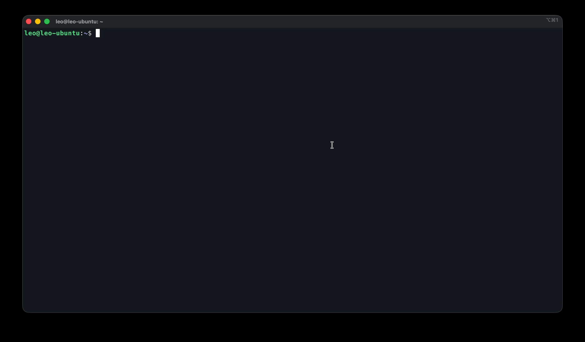

# ros-is-ros2

ROS 1-style CLI aliases for ROS 2, with working autocompletion.

For detailed documentation on usage, development, and troubleshooting, please see the [full documentation](docs/index.md).

## Installation

### Requirements

- ROS2 (Humble; Iron, Jazzy, and Rolling not tested yet)
- Python 3.8+
- Bash shell (Zsh shell is still not supported, welcome to contribute!)

**Note**: For bash users, `bash-completion` will be automatically installed during setup for an optimal tab completion experience.

### From GitHub Releases (Recommended)
Download the latest wheel file from [GitHub Releases](https://github.com/leochien1110/ros-is-ros2/releases):

```bash
# Download ros_is_ros2-X.X.X-py3-none-any.whl from releases, then:
pip install ros_is_ros2-0.4.0-py3-none-any.whl
ros-is-ros2 install    # Automatically installs bash-completion if needed
source ~/.bashrc       # or ~/.zshrc
```

### From PyPI (when published)
```bash
pip install ros-is-ros2
ros-is-ros2 install    # Automatically installs bash-completion if needed
source ~/.bashrc       # or ~/.zshrc
```

### From Source
```bash
git clone https://github.com/leochien1110/ros-is-ros2.git
cd ros-is-ros2
pip install .
ros-is-ros2 install
source ~/.bashrc       # or ~/.zshrc
```

## Quick Use

Once installed, your favorite ROS 1 commands will be available with full tab-completion.

### Command Aliases

| ROS 1 Style | ROS 2 Equivalent |
|-------------|------------------|
| `rostopic`  | `ros2 topic`     |
| `rosnode`   | `ros2 node`      |
| `rosservice`| `ros2 service`   |
| `rosparam`  | `ros2 param`     |
| `rosbag`    | `ros2 bag`       |
| `rosrun`    | `ros2 run`       |
| `roslaunch` | `ros2 launch`    |
| `rospack`   | `ros2 pkg`       |
| `rossrv`    | `ros2 interface` |
| `rosmsg`    | `ros2 interface` |

### ROS Domain ID Autocompletion

Quickly check or set your ROS Domain ID with tab completion:

```bash
# Check current ROS_DOMAIN_ID
rosdomainid
# Output: 42 (or "unset" if not configured)

# Set ROS_DOMAIN_ID with tab completion
rosdomainid <TAB>
# Shows: 0 1 2 3 ... 101

# Set to a specific domain
rosdomainid 42
# Output: ROS_DOMAIN_ID set to 42
```

### Launch Argument Autocompletion

Enjoy ROS 1-style tab completion for launch arguments:


*Native ROS 2 launch argument completion*


*ROS 1-style launch argument completion with ros-is-ros2, ~10s faster*

```bash
# Type 'roslaunch <pkg> <launch_file> ' and press <TAB>
roslaunch realsense2_camera rs_launch.py <TAB>
# Shows: camera_name:= camera_namespace:= serial_no:= ...

# Partial argument completion also works
roslaunch realsense2_camera rs_launch.py cam<TAB>
# Shows: camera_name:= camera_namespace:=
```

## Uninstallation

```bash
ros-is-ros2 uninstall  # Removes shell integration and cleans cache
pip uninstall ros-is-ros2
source ~/.bashrc    # or ~/.zshrc
```

## License

This project is licensed under the **GNU General Public License v3.0 or later** (GPL-3.0-or-later). See [LICENSE](LICENSE) for details.
